<h3><code>rh0kzy@github ~ $ ./contributions.sh</code></h3>

 
 

<!-- portrait: placeholder until a photo is provided.
     To unlock the true ASCII portrait:
       python scripts/prep_photo.py <photo.jpg>
       python scripts/make_ascii_svg.py
     info card: python scripts/make_info_card.py -->

<h3><code>rh0kzy@github ~ $ whoami</code></h3>

<table>
<tr>
<td valign="top"></td>
<td valign="top"></td>
</tr>
</table>

 
 

<h3><code>rh0kzy@github ~ $ ./links.sh</code></h3>

<b>Full-Stack Developer · AI Engineering Student · Co-Founder @ Massar Agency</b>

 

---

### 👤 About Me

I'm a co-founder and full-stack developer at **Massar Agency**, a digital agency in Algiers building web apps, mobile apps, and brand identities for Algerian SMBs. In parallel, I'm a 3rd-year Computer Engineering student at **USTHB**, specializing in AI Engineering.

- 🔭 Currently building **PhoneMAG** (desktop POS for phone retail) and **EdenStore** (offline-first perfume shop management)
- 🌱 Deepening my skills in **agentic AI workflows** and **local/cloud LLM integration**
- 🎯 Focused on adapting proven international SaaS products for the Algerian market
- 📫 Reach me at **contact.aymenbelkadi@gmail.com**
- 🌐 Portfolio: **[aymen-belkadi.vercel.app](https://aymen-belkadi.vercel.app)**
- ⚡ Fun fact: my cat Meat Nu supervises most of my debugging sessions

---

### 🛠️ Tech Stack

**Frontend**

**Mobile**

**Backend**

**Data & AI**

  

**Databases & Infra**

---

### 🚀 Featured Projects

| Project | Description | Stack |
|---|---|---|
| **PhoneMAG** | Desktop POS system for phone retail with auto-update CI/CD | Electron · React · Django |
| **EdenStore** | Offline-first perfume shop management app with cloud sync | Electron · SQLite · Supabase |
| **VintageDrop** | Vintage clothes e-commerce with drop-culture mechanics | Next.js · Django · Supabase |
| **HireAI** | AI recruitment platform with CV parsing & video interviews | Next.js · Supabase · LLMs |
| **Sovereign-Vision** | YOLOv8s object detection pipeline for arid environments | Python · PyTorch · YOLOv8 |

---

### 🤝 Connect with Me

  
  
  

<i>⚡ CR Belouizdad supporter · Building for the Algerian tech scene, one project at a time</i>

---

Profile art is self-generated SVG (no stats services, no token) — see <code>scripts/</code> + <code>.github/workflows/update-profile-art.yml</code>. Heatmap refreshes daily.
